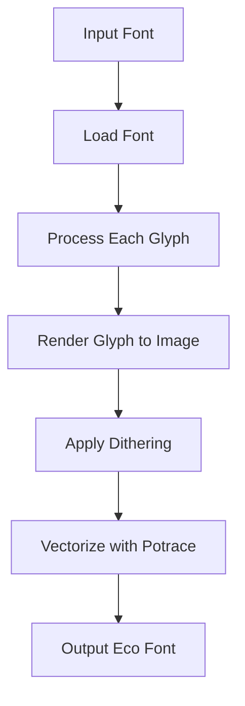

# FontEco <a href = ""></a>

[](https://github.com/ctlab/samovar/actions/workflows/python-package.yaml)

FontEco is a Python tool for creating eco-friendly fonts

This process reduces the amount of ink needed to print text while maintaining readability.

## Features

- Making your fonts more "eco-friendly"
- Different dithering modes:
  - Blue Noize
  - Shape
  - Line
- Customizable applications

## How It Works

FontEco uses a sophisticated pipeline to create eco-friendly fonts by intelligently removing dots from glyphs while maintaining readability. Here's how the process works:

1. **Glyph Rendering**:
   - Each glyph from the input font is rendered to a high-resolution image (512x512)
   - Special handling for composite glyphs and Cyrillic characters
   - Automatic scaling to maintain proper proportions
   - Uses PIL (Python Imaging Library) for high-quality glyph rendering

2. **Dithering**:
   - Several different algorithms implemented
   - Uses Sobol' sequence algorithm to generate a uniform distribution of points
   - Applies Floyd-Steinberg dithering with blue noise pattern
   - Configurable reduction percentage (default: 20%)
   - Ensures visually pleasing distribution of removed dots

3. **Vectorization**:
   - Converts the dithered image back to vector outlines using Potrace algorithm
   - Multiple rendering modes available for different use cases:
     - Original: Uses Potrace's default path tracing
     - Simplified: Reduces the number of transparency levels (optimal: 4 levels)
     - Optimized: Uses point clustering and path optimization (optimal: 100 grid size)
     - Optimized Masked: Like optimized but ensures paths stay within glyph boundaries
   - Applies Douglas-Peucker algorithm for path simplification
   - Uses Bézier curve fitting for smooth outlines
   - Optimizes control points using distance-based filtering

4. **Font Generation**:
   - Scales the glyphs to match the original font metrics
   - Updates font metadata and naming
   - Preserves font features and compatibility
   - Uses fontTools for font manipulation and optimization



## Dithering Modes

The library supports three main dithering modes:

### 1. Blue Noise Dithering
Uses Sobol' sequences to create a blue noise pattern for removing dots from glyphs. This creates a visually pleasing, random-looking pattern that maintains readability.

### 2. Shape-Based Dithering
A mode that removes dots in specific shapes (circles or rectangles) while maintaining readability. This mode offers more control over the visual appearance of the perforation.

### 3. Line-Based Dithering
A mode that removes dots by drawing lines across the glyphs. This mode offers several options for creating different line patterns.

## Installation

1. Clone the repository:
```bash
git clone https://github.com/yourusername/FontEco.git
cd FontEco
```

2. Install system dependencies:
```bash
sudo apt-get update
sudo apt-get install -y build-essential python3-dev libagg-dev libpotrace-dev pkg-config
```

3. Install dependencies:
```bash
pip install -r requirements.txt
```

## Usage

1. Create a subset of your font (optional):
```python
from fonteco.font_utils import create_subset_font
create_subset_font('fonts/Times.ttf', 'fonts/Times_subset.ttf')
```

2. Perforate the font:
```python
from fonteco.fonts import perforate_font
perforate_font(
    input_font_path='fonts/Times.ttf',
    output_font_path='fonts/EcoTimes.ttf',
    reduction_percentage=20  # Default: 20%
)
```

## Parameters

- `input_font_path` (str): Path to the input font file
- `output_font_path` (str): Path where the perforated font will be saved
- `reduction_percentage` (float): Percentage of dots to remove (0-100). Default: 20
- `with_bug` (bool): Enable special coordinate transformation (bug mode). Default: False
- `draw_images` (bool): Save debug images of perforated glyphs. Default: False
- `scale_factor` (float or str): Scaling factor for glyph coordinates. Use "AUTO" for automatic scaling. Default: "AUTO"
- `test` (bool): Process only first 20 glyphs for testing. Default: False
- `debug` (bool): Print detailed debug information. Default: False
- `render_mode` (str): Rendering mode to use for glyph conversion:
  - "original": Uses Potrace's default path tracing
  - "simplified": Reduces the number of transparency levels (optimal: 4 levels)
  - "optimized": Uses point clustering and path optimization (optimal: 100 grid size)
  - "optimized_masked": Like optimized but ensures paths stay within glyph boundaries
- `dithering_mode` (str):
  - "blue_noise": Uses Sobol' sequence and blue noise dithering for natural-looking dot patterns
  - "shape": Uses shape-based dithering with circles or rectangles
  - "line": Uses line-based dithering with parallel or random lines
- `shape_type` (str): Type of shape to use for shape dithering ("circle" or "rectangle"). Default: "circle"
- `shape_size` (int or str): Size of shapes for shape dithering:
  - int: exact size in pixels
  - "random": random size between margin*2 and maximum possible
  - "biggest": biggest possible size that fits
- `margin` (int): Minimum margin between shapes and edges for shape dithering. Default: 1
- `num_levels` (int): Number of transparency levels for simplified mode (optimal: 4) or grid size for optimized mode (optimal: 100). Default: 2
- `line_type` (str): Type of line pattern for line-based dithering
- `curve_type` (str): Type of curve for line-based dithering
- `line_width` (int): Width of the lines in pixels for line-based dithering
- `curve` (int): Curvature amount for curved lines in line-based dithering

## Features in Detail

- **Automatic Scaling**: When `scale_factor="AUTO"`, the tool automatically calculates the optimal scaling factor based on font metrics
- **Cyrillic Support**: Handles both Latin and Cyrillic characters, including composite glyphs
- **Progress Tracking**: Shows a progress bar during font processing
- **Debug Mode**: Optional detailed logging of glyph processing steps
- **Multiple Rendering Modes**: Choose the best rendering approach for your needs:
  - Original mode for standard perforation
  - Simplified mode for reduced complexity
  - Optimized mode for better path construction
  - Optimized masked mode for boundary-aware perforation

## Requirements

- Python 3.6+
- fontTools
- Pillow
- NumPy
- OpenCV
- potrace + pypotrace
- scipy (for dithering)
- tqdm (for progress bar)

MIT License

## Contributing

Contributions are welcome! Please feel free to submit a Pull Request.
