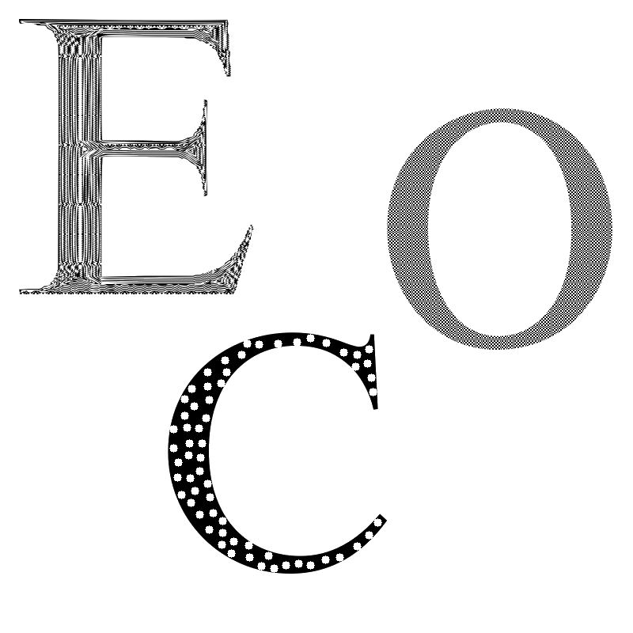

# FontEco <a href = ""></a>

FontEco is a Python tool for creating eco-friendly fonts by perforating existing fonts using Sobol' sequence and blue noise dithering techniques. This process reduces the amount of ink needed to print text while maintaining readability.

## Features

- Making your fonts more "eco-friendly"
- Blue noise dithering using Sobol' sequences
- Font perforation with configurable reduction percentage
- Support for both Latin and Cyrillic characters
- Automatic scaling and optimization

## Installation

1. Clone the repository:
```bash
git clone https://github.com/yourusername/FontEco.git
cd FontEco
```

2. Install dependencies:
```bash
pip install -r requirements.txt
```

## Usage

1. Create a subset of your font (optional):
```python
from fonteco.font_utils import create_subset_font
create_subset_font('fonts/Times.ttf', 'fonts/Times_subset.ttf')
```

2. Perforate the font:
```python
from fonteco.fonts import perforate_font
perforate_font(
    input_font_path='fonts/Times.ttf',
    output_font_path='fonts/EcoTimes.ttf',
    reduction_percentage=20,  # Default: 20%
    with_bug=False,          # Default: False
    draw_images=False,       # Default: False
    scale_factor="AUTO",     # Default: "AUTO"
    test=False,              # Default: False
    debug=False              # Default: False
)
```

## Parameters

- `input_font_path` (str): Path to the input font file
- `output_font_path` (str): Path where the perforated font will be saved
- `reduction_percentage` (float): Percentage of dots to remove (0-100). Default: 20
- `with_bug` (bool): Enable special coordinate transformation (bug mode). Default: False
- `draw_images` (bool): Save debug images of perforated glyphs. Default: False
- `scale_factor` (float or str): Scaling factor for glyph coordinates. Use "AUTO" for automatic scaling. Default: "AUTO"
- `test` (bool): Process only first 20 glyphs for testing. Default: False
- `debug` (bool): Print detailed debug information. Default: False

## Features in Detail

- **Automatic Scaling**: When `scale_factor="AUTO"`, the tool automatically calculates the optimal scaling factor based on font metrics
- **Cyrillic Support**: Handles both Latin and Cyrillic characters, including composite glyphs
- **Progress Tracking**: Shows a progress bar during font processing
- **Debug Mode**: Optional detailed logging of glyph processing steps

## Requirements

- Python 3.6+
- fontTools
- Pillow
- NumPy
- OpenCV
- potrace + pypotrace
- scipy (for dithering)
- tqdm (for progress bar)

## License

MIT License

## Contributing

Contributions are welcome! Please feel free to submit a Pull Request. 